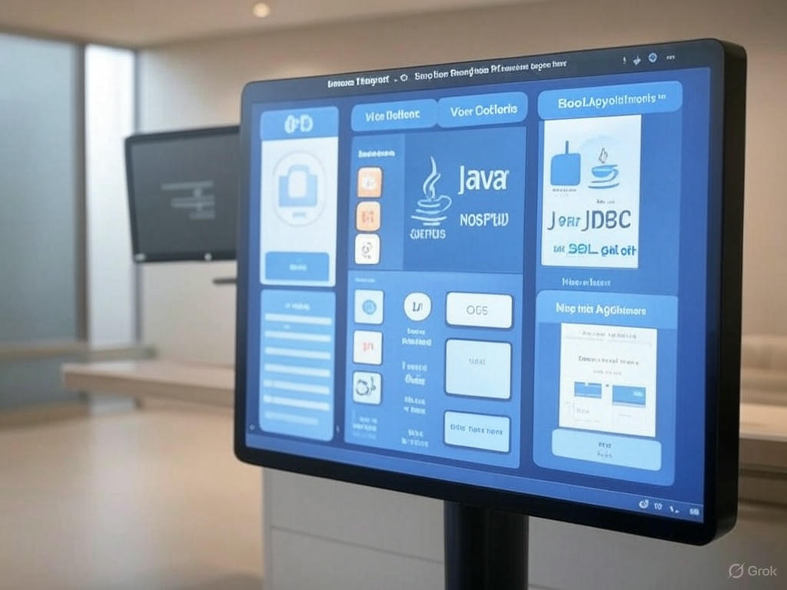
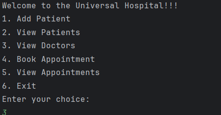
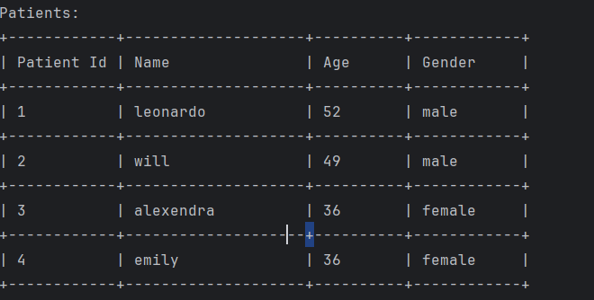
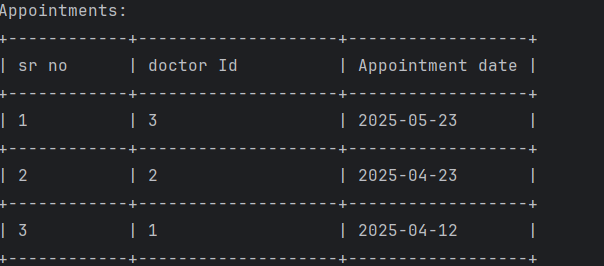

# Universal-Hospital 
# Universal Hospital - Hospital Management System 🏥




## 📌 Project Overview
Universal Hospital is a **console-based Hospital Management System** that helps manage patients, doctors, and appointments efficiently. Built using **Java, JDBC, and MySQL**, it provides a seamless experience for handling hospital-related tasks.

## ✨ Features
- 🏥 **Add Patient** - Register new patients into the system.
- 👩‍⚕️ **View Patients** - Display a list of registered patients.
- 🩺 **View Doctors** - Check available doctors and their specialties.
- 📅 **View Appointments** - See scheduled appointments.
- 📌 **Book Appointment** - Schedule an appointment for a patient.

## 🛠️ Tech Stack
- **Java** - Core development language.
- **JDBC** - Database connectivity.
- **MySQL** - Database for storing records.
- **Git & GitHub** - Version control and collaboration.

## 📸 Screenshots
| Main Menu | Add Patient | View Appointments |
|-----------|------------|------------------|
|  |  |  |


## 🚀 Getting Started
### 1️⃣ Clone the Repository
```sh
git clone https://github.com/Shubham17121999/Universal-Hospital

cd universal-hospital


```

### 2️⃣ Set Up the Database
- Create a MySQL database named `hospital`.
- Run the provided SQL script to set up the necessary tables.


### 3️⃣ Run the Project
```sh
javac management.java
java management
```


## 🤝 Contributing
Feel free to fork this repo and contribute by adding new features or improving existing functionality!

## 📜 License
This project is open-source and available under the [MIT License](LICENSE).

🚀 Happy Coding! 💙

